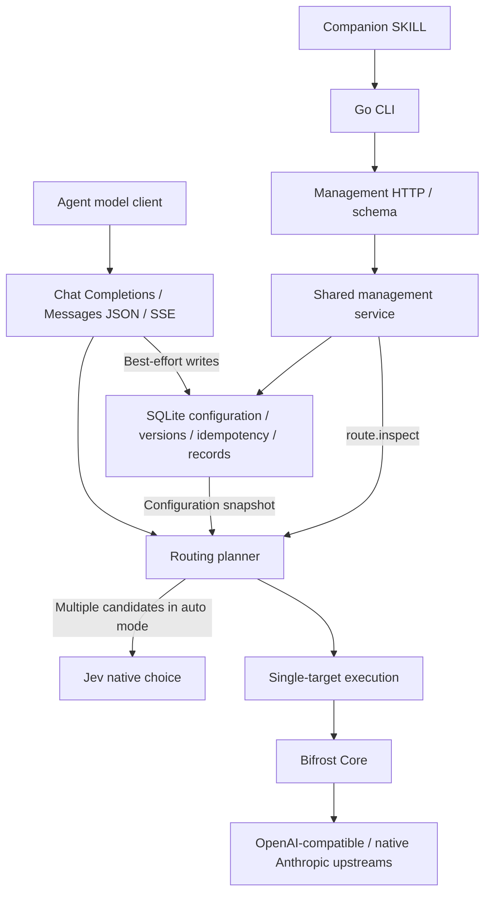

# Jev Model Router

English | [简体中文](README.zh-CN.md)

A lightweight model routing gateway for agents. Connect OpenAI Chat Completions or Anthropic Messages clients, select an explicit model or let Jev choose from editable model cards, and manage providers through a CLI and bilingual dashboard.

The current release is [v0.1.17](https://github.com/zerone-agents/jev-model-router/releases/tag/v0.1.17). It runs as a single Go service with SQLite, streams text and tool calls, and supports OpenAI-compatible and native Anthropic generation upstreams within the matrix below. Local Laya, sensitive-session locking, ArbiterOS and PostgreSQL remain planned.

## Client and upstream support

| Client entry point | OpenAI-compatible upstream | Native Anthropic upstream |
| --- | --- | --- |
| `/v1/chat/completions` | JSON / SSE | JSON / SSE, including supported thinking and tool continuations |
| `/v1/messages` | JSON / SSE through conversion | Planned in [#51](https://github.com/zerone-agents/jev-model-router/issues/51) |

Support is limited to the fields and combinations in the [compatibility matrix](docs/compatibility.md). Unsupported conversions fail explicitly. BigModel `glm-5.3` and `glm-5.3-flash` passed 12 original Agent SDK examples through the local Router; see the [compatibility and validation scope](docs/compatibility.md). This does not establish compatibility with every Anthropic deployment or native signed thinking history.

## Getting started

Recommended: deploy the prebuilt Docker Hub image with [Docker Compose Quickstart](quickstart/README.md). It includes persistent SQLite and the management UI; no local Go or Node installation is needed.

### Local CLI

To manage a remote Compose instance, download the CLI from GitHub Releases. See [CLI installation and remote access](docs/cli-installation.md).

### Run from source

Requires Go 1.27.0. The SQLite driver does not require CGO.

```sh
go build -o /tmp/jev-router ./cmd/jev-router
# Securely inject distinct JEV_ROUTER_SETTINGS_TOKEN / JEV_ROUTER_INFERENCE_TOKEN values
/tmp/jev-router serve
```

The default listener is `127.0.0.1:8080`, and the database is `.data/router.sqlite`. Use `serve --config conf.json` and environment overrides as described in [startup configuration](docs/configuration.md). Two distinct credentials must be available at startup.

## Management UI

```sh
/tmp/jev-router serve
# In another terminal
/tmp/jev-router dashboard
# Headless environment: print the address without probing or opening a browser
/tmp/jev-router dashboard --no-open
```

The UI is served at `/dashboard/` by the same Go binary. Use `dashboard --url https://router.example.com` for a remote instance. This command never starts the server or passes credentials to the browser. Enter the Settings credential once to establish a 7-day HttpOnly session; refresh and same-credential restart retain login. Logout revokes the current session. Remote browser access requires HTTPS and `JEV_ROUTER_DASHBOARD_ORIGIN`; see [session configuration](docs/configuration.md#dashboard-sessions).

The English/Chinese UI shows instance status, models, the routing prompt and routing records. It edits model descriptions and the prompt through the existing management API, preserving version conflicts and explicit same-key retries. Configure providers, model mappings and capabilities through the CLI. See [UI development and boundaries](web/README.md).

## Agent configuration workflow

```sh
/tmp/jev-router --help
/tmp/jev-router schema
/tmp/jev-router schema providers.put
/tmp/jev-router call status.get --json /tmp/empty-object.json
/tmp/jev-router call providers.put --json /tmp/provider.json --expected-version 1 --idempotency-key setup-provider-1
```

The contents of `empty-object.json` are `{}`. A complete provider configuration example (inject `PROVIDER_API_KEY` first):

```json
{"id":"cloud","protocol":"openai","base_url":"https://api.openai.com/v1","secret_ref":"env:PROVIDER_API_KEY"}
```

Configure a disabled model using `schema models.put`, run the fixed connection test with `call models.test --id <ID>`, read the current version and enable the model, then check routing with `route.inspect`. Automatic routing with multiple candidates also requires `decision.put` to configure the Jev root URL, native model version, and secret reference. Use `prompt.put` to edit the single default balanced template. Supply complex inputs through JSON files or stdin; all writes include a version and an idempotency key. See the [companion SKILL](skills/jev-router/SKILL.md) for the complete workflow.

Use `/v1/models` to discover enabled public model IDs. The settings credential is only for management and fixed tests; generation uses the inference credential.

## Call the inference API

OpenAI clients use `http://127.0.0.1:8080/v1` as their base URL. Anthropic SDK clients use the root `http://127.0.0.1:8080`; the SDK appends `/v1/messages`. Both use the inference credential and `auto` or an enabled public model ID.

```sh
curl http://127.0.0.1:8080/v1/chat/completions \
  -H "Authorization: Bearer $JEV_ROUTER_INFERENCE_TOKEN" \
  -H 'Content-Type: application/json' \
  -d '{"model":"auto","messages":[{"role":"user","content":"Hello"}],"max_tokens":1024}'

curl http://127.0.0.1:8080/v1/messages \
  -H "x-api-key: $JEV_ROUTER_INFERENCE_TOKEN" \
  -H 'anthropic-version: 2023-06-01' \
  -H 'Content-Type: application/json' \
  -d '{"model":"auto","messages":[{"role":"user","content":"Hello"}],"max_tokens":1024}'
```

Add `"stream":true` for SSE. Messages currently selects only OpenAI-compatible upstreams; use Chat Completions if you have configured only native Anthropic upstreams. See the [Anthropic SDK example](examples/anthropic-messages.mjs) and [native upstream configuration](docs/configuration.md#native-anthropic-generation-upstream).

## Routing behavior

- No candidates means failure; a single candidate is selected directly; multiple candidates invoke Jev on every request. Explicit model selection skips Jev.
- Preferences live primarily in prompts and natural-language model cards. Code enforces authorization, capability, capacity, and protocol boundaries.
- `auto` is a reserved ID. Generation requests are not truncated, parameters are not silently dropped, and requests are not retried or switched to another model.
- Jev mode provides no sensitive-data routing guarantee. Conversation text may go to Jev. Image data, tool definitions, tool arguments and tool outputs are excluded; paired tool IDs and names remain.
- Configuration writes affect new requests immediately. Disabling a model does not revoke snapshots already in use.
- Records retain routing metadata and up to 120 characters from the latest user message. Default retention is seven days or 100,000 records, whichever limit is reached first. Writes are best effort and degraded status is exposed; these records are not audit logs.

See the [compatibility matrix](docs/compatibility.md) for supported fields and estimation limits, and the [evaluation guide](docs/evaluation.md) for measuring real-world quality and cost.

## Architecture



## Directory structure

```text
.
├── cmd/          # Executable entry points
├── internal/     # Routing, management, storage, and protocol adapters
├── contracts/    # Machine-readable contracts and validation
├── templates/    # Single balanced prompt
├── skills/       # Agent workflows
├── tests/        # Black-box end-to-end tests
├── evals/        # Explicitly invoked paid evaluation tooling and synthetic data
├── services/     # Future local Laya service
├── web/          # Embedded bilingual management UI
└── docs/         # Architecture, configuration, compatibility, and contributor conventions
```

## Development checks

CI runs tests and lint in parallel. Lint uses a pinned version of golangci-lint with govet, staticcheck, and unused enabled, and requires all Go files to follow gofmt formatting.

```sh
go install github.com/golangci/golangci-lint/v2/cmd/golangci-lint@v2.14.0
golangci-lint run ./...
# Expect no output; use gofmt -w on any files listed
git ls-files -z '*.go' | xargs -0 gofmt -l
go test ./... -count=1
go test -race ./... -count=1
go vet ./...
```

Default tests access local mock endpoints. Optional SDK tests require a local SDK installation; explicitly enabled live acceptance tests call paid upstreams and can execute example tools. See [validation scope](docs/compatibility.md#sdk-完整-agent-examples). Start with the [architecture](docs/architecture.md), [management contract](contracts/README.md), and [domain terminology](CONTEXT.md). Local research, implementation specifications, ADRs and per-run acceptance records are excluded from Git by convention.
