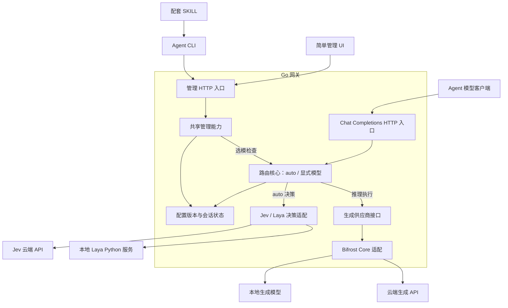

# Jev Model Router

面向 Agent 的模型路由网关：用 Jev 或 Laya，根据任务与可编辑的模型描述选择生成模型；提供 Chat Completions 兼容入口、Agent CLI 和配套 SKILL，人类通过简单 UI 查看与调整。

**当前状态：架构与目录骨架。尚无可执行 CLI、HTTP 服务或 UI。** 目录内说明定义实现位置，不代表功能已交付。未声明 AgentUse 认证。

## 产品约定

- `model=auto` 通过提示词选模；指定模型 ID 则跳过任务选模，保留权限、能力和敏感边界检查。
- 默认只提供一份可编辑的均衡提示词，不内置多档策略模式或任务到模型的映射表。
- Jev 模式不启用敏感路由；本地 Laya 模式可启用，并保持敏感会话的本地锁定。
- Go 承担网关和 CLI；Bifrost Core 封装为供应商适配，Laya 的推理与完整输入检查留在本地 Python 服务。
- Agent 管理能力优先通过自描述 CLI 暴露，SKILL 提供工作流；UI 复用同一管理能力。

## 架构

以下为待实现架构。CLI 与 UI 复用管理能力；模型客户端通过 Chat Completions 接口发起推理。



选模检查只预览路由结果，不执行生成或修改会话状态；调用决策后端仍可能产生费用和数据外发。敏感路由仅在本地 Laya 模式下可启用，Jev 模式不启用。

## 目录结构

当前目录以职责说明为主，后续代码按以下边界实现：

```text
.
├── cmd/                    # 可执行入口与命令装配
├── internal/               # Go 网关核心、协议适配与状态管理
├── contracts/              # Agent 管理能力契约
├── templates/              # 可编辑的默认均衡提示词
├── skills/                 # 配套 CLI 使用技能
│   └── jev-router/SKILL.md
├── services/               # 本地 Laya 等独立服务
├── web/                    # 简单管理 UI
└── docs/                   # 详细架构、决策记录与协作规范
```

## 从哪里开始

- [架构与目录边界](docs/architecture.md)
- [Agent 管理契约](contracts/README.md)
- [领域术语](CONTEXT.md)
- [架构决策](docs/adr/0001-agent-first-shared-control.md)
- [CLI 配套技能](skills/jev-router/SKILL.md)
- [默认均衡提示词](templates/balanced.md)

运行时的命令、参数和能力以实际发布的 CLI schema 为准；当前没有安装或运行指令。开发阶段的本地调研和过程规格保存在忽略目录，公开架构不依赖这些文件。
