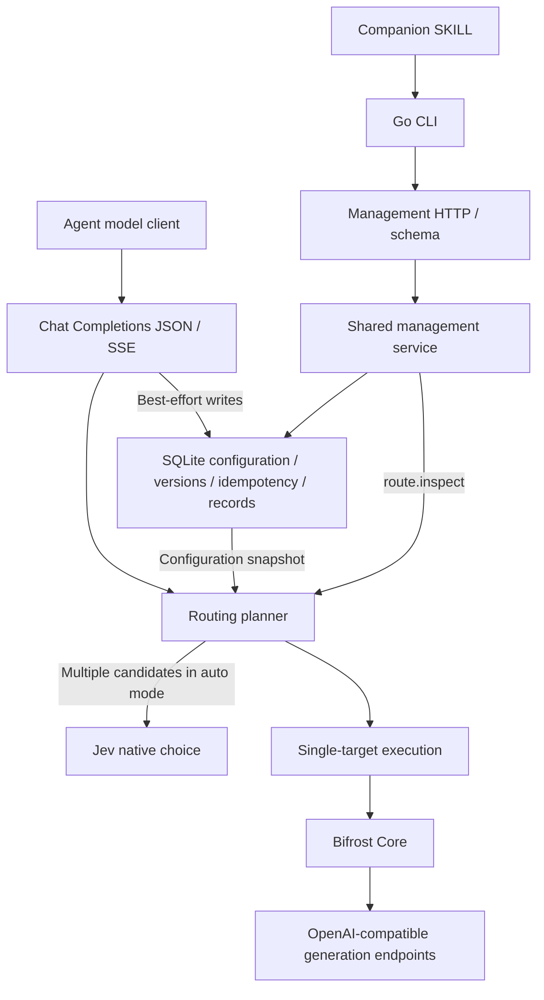

# Jev Model Router

English | [简体中文](README.zh-CN.md)

A lightweight model routing gateway for agents. It uses Jev's native choice capability to select models based on the task and editable model cards, with OpenAI Chat Completions-compatible JSON/SSE, a management CLI, and a companion SKILL.

The first release implements a single-instance Go gateway with SQLite, explicit and automatic model selection, and an OpenAI-compatible generation adapter. Local Laya, sensitive-session locking, ArbiterOS and PostgreSQL are planned for later phases. Small-sample routing and Agent diagnostic baselines are recorded in the [acceptance summary](docs/acceptance/2026-09-29.md); production-wide quality and economic benefits remain unverified. No AgentUse certification is claimed.

## Getting started

Requires Go 1.27.0. The SQLite driver does not require CGO.

```sh
go build -o /tmp/jev-router ./cmd/jev-router
# Securely inject distinct JEV_ROUTER_SETTINGS_TOKEN / JEV_ROUTER_INFERENCE_TOKEN values
/tmp/jev-router serve
```

The default listener is `127.0.0.1:8080`, and the database is `.data/router.sqlite`. Use `serve --config conf.json` and environment overrides as described in [startup configuration](docs/configuration.md). Two distinct credentials must be available at startup.

## Management UI

```sh
/tmp/jev-router serve
# In another terminal
/tmp/jev-router dashboard
# Headless environment: print the address without probing or opening a browser
/tmp/jev-router dashboard --no-open
```

The UI is served at `/dashboard/` by the same Go binary. Use `dashboard --url https://router.example.com` for a remote instance. This command never starts the server or passes credentials to the browser. Enter the settings credential on the page; it stays in page memory and must be entered again after refresh. Remote connections require HTTPS.

The English/Chinese UI shows instance status, models, the routing prompt and routing records. It edits model descriptions and the prompt through the existing management API, preserving version conflicts and explicit same-key retries. Configure providers, model mappings and capabilities through the CLI. See [UI development and boundaries](web/README.md).

## Agent configuration workflow

```sh
/tmp/jev-router --help
/tmp/jev-router schema
/tmp/jev-router schema providers.put
/tmp/jev-router call status.get --json /tmp/empty-object.json
/tmp/jev-router call providers.put --json /tmp/provider.json --expected-version 1 --idempotency-key setup-provider-1
```

The contents of `empty-object.json` are `{}`. A complete provider configuration example (inject `PROVIDER_API_KEY` first):

```json
{"id":"cloud","base_url":"https://api.openai.com/v1","secret_ref":"env:PROVIDER_API_KEY"}
```

Configure a disabled model using `schema models.put`, run the fixed connection test with `call models.test --id <ID>`, read the current version and enable the model, then check routing with `route.inspect`. Automatic routing with multiple candidates also requires `decision.put` to configure the Jev root URL, native model version, and secret reference. Use `prompt.put` to edit the single default balanced template. Supply complex inputs through JSON files or stdin; all writes include a version and an idempotency key. See the [companion SKILL](skills/jev-router/SKILL.md) for the complete workflow.

Set the inference client's base URL to `http://127.0.0.1:8080/v1` and use the inference credential as its API key. Set `model: "auto"` for automatic selection, or specify an enabled public model ID returned by `/v1/models`. The settings credential is only for management and fixed tests.

## Routing behavior

- No candidates means failure; a single candidate is selected directly; multiple candidates invoke Jev on every request. Explicit model selection skips Jev.
- Preferences live primarily in prompts and natural-language model cards. Code enforces authorization, capability, capacity, and protocol boundaries.
- `auto` is a reserved ID. Generation requests are not truncated, parameters are not silently dropped, and requests are not retried or switched to another model.
- Jev mode provides no sensitive-data routing guarantee. Image fields are not sent to Jev, but text and tool results may be.
- Configuration writes affect new requests immediately. Disabling a model does not revoke snapshots already in use.
- Records retain routing metadata only, with a default retention of seven days. Writes are best effort and degraded status is exposed; these records are not audit logs.

See the [compatibility matrix](docs/compatibility.md) for supported fields and estimation limits, and the [evaluation guide](docs/evaluation.md) for measuring real-world quality and cost.

## Architecture



## Directory structure

```text
.
├── cmd/          # Executable entry points
├── internal/     # Routing, management, storage, and protocol adapters
├── contracts/    # Machine-readable contracts and validation
├── templates/    # Single balanced prompt
├── skills/       # Agent workflows
├── tests/        # Black-box end-to-end tests
├── evals/        # Explicitly invoked paid evaluation tooling and synthetic data
├── services/     # Future local Laya service
├── web/          # Embedded bilingual management UI
└── docs/         # Architecture, configuration, compatibility, and contributor conventions
```

## Development checks

CI runs tests and lint in parallel. Lint uses a pinned version of golangci-lint with govet, staticcheck, and unused enabled, and requires all Go files to follow gofmt formatting.

```sh
go install github.com/golangci/golangci-lint/v2/cmd/golangci-lint@v2.14.0
golangci-lint run ./...
# Expect no output; use gofmt -w on any files listed
git ls-files -z '*.go' | xargs -0 gofmt -l
go test ./... -count=1
go test -race ./... -count=1
go vet ./...
```

Tests access local mock endpoints only. Start with the [architecture](docs/architecture.md), [management contract](contracts/README.md), and [domain terminology](CONTEXT.md). Local research, implementation specifications, and ADRs are excluded from Git by convention.
