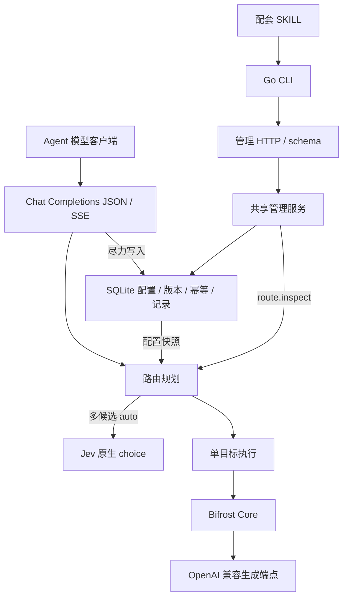

# Jev Model Router

[English](README.md) | 简体中文

面向 Agent 的轻量模型路由网关。以 Jev 原生 choice 根据任务和可编辑模型卡选模，提供 OpenAI Chat Completions 兼容 JSON/SSE、管理 CLI 与配套 SKILL。

首版已实现 Go 单实例 + SQLite、显式/自动选模和 OpenAI 兼容生成适配。本地 Laya、敏感会话锁定、ArbiterOS、PostgreSQL 与 UI 属于后续阶段。尚未完成真实模型付费质量基线，未声明 AgentUse 认证。

## 启动

需要 Go 1.27.0；SQLite 驱动无需 CGO。

```sh
go build -o /tmp/jev-router ./cmd/jev-router
# 通过安全环境注入不同的 JEV_ROUTER_SETTINGS_TOKEN / JEV_ROUTER_INFERENCE_TOKEN
/tmp/jev-router serve
```

默认监听 `127.0.0.1:8080`，数据库为 `.data/router.sqlite`。支持 `serve --config conf.json` 和环境变量覆盖，详见[启动配置](docs/configuration.md)。启动时必须存在两种不同凭证。

## Agent 配置流程

```sh
/tmp/jev-router --help
/tmp/jev-router schema
/tmp/jev-router schema providers.put
/tmp/jev-router call status.get --json /tmp/empty-object.json
/tmp/jev-router call providers.put --json /tmp/provider.json --expected-version 1 --idempotency-key setup-provider-1
```

`empty-object.json` 内容是 `{}`。供应商完整配置示例（先注入 `PROVIDER_API_KEY`）：

```json
{"id":"cloud","base_url":"https://api.openai.com/v1","secret_ref":"env:PROVIDER_API_KEY"}
```

按 `schema models.put` 配置禁用模型 → `call models.test --id <ID>` 固定连接测试 → 读取版本并启用 → `route.inspect` 检查。多候选 auto 还需 `decision.put` 配置 Jev 根地址、原生模型版本和密钥引用。用 `prompt.put` 修改唯一默认均衡模板。复杂输入使用 JSON 文件或 stdin，所有写入携带版本与幂等键。完整工作流见[配套 SKILL](skills/jev-router/SKILL.md)。

推理客户端配置 base URL 为 `http://127.0.0.1:8080/v1`，API key 使用 inference 凭证；`model: "auto"` 自动选择，也可使用 `/v1/models` 返回的已启用外部 ID。settings 仅用于管理及固定测试。

## 路由约定

- 零候选失败、单候选直达、多候选每次调用 Jev；显式选择跳过 Jev。
- 偏好尽量交给提示词和自然语言模型卡；代码仅锁定权限、能力、容量及协议边界。
- `auto` 为保留 ID。完整生成请求不裁剪，参数不静默丢失，不重试或换模。
- Jev 模式没有敏感路由保证；图片字段不送 Jev，文本和工具结果可能送往 Jev。
- 配置写入立即影响新请求；禁用模型不撤销在途快照。
- 记录默认保留 7 天，只存路由元数据，尽力写入并公开降级状态，不是审计日志。

支持字段及估算局限见[兼容矩阵](docs/compatibility.md)，真实质量与费用的验证方式见[评测说明](docs/evaluation.md)。

## 架构



## 目录

```text
.
├── cmd/          # 可执行入口
├── internal/     # 路由、管理、存储与协议适配
├── contracts/    # 机器契约与校验
├── templates/    # 唯一均衡提示词
├── skills/       # Agent 工作流
├── tests/        # 黑盒端到端测试
├── evals/        # 显式付费评测工具与合成数据
├── services/     # 后续本地 Laya 服务
├── web/          # 后续 UI
└── docs/         # 架构、配置、兼容及协作规范
```

## 开发验证

CI 并行运行测试与 lint。Lint 使用固定版本的 golangci-lint，启用 govet、staticcheck、unused，并要求所有 Go 文件符合 gofmt。

```sh
go install github.com/golangci/golangci-lint/v2/cmd/golangci-lint@v2.14.0
golangci-lint run ./...
# 应无输出；有输出时用 gofmt -w 修正对应文件
git ls-files -z '*.go' | xargs -0 gofmt -l
go test ./... -count=1
go test -race ./... -count=1
go vet ./...
```

测试只访问本地模拟端点。[架构](docs/architecture.md)、[管理契约](contracts/README.md)、[领域术语](CONTEXT.md) 是协作入口。本地研究、实施规格与 ADR 按约定不进入 Git。
