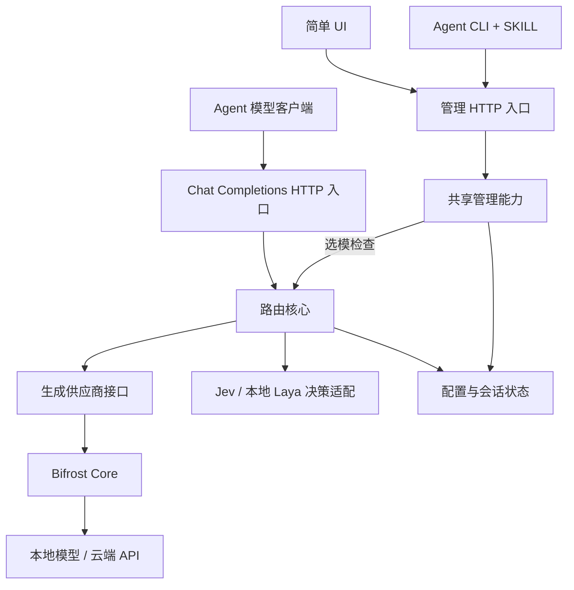

# 架构

本文记录当前产品决策与实现边界。仓库处于目录骨架阶段；下面的入口、契约和调用路径是待实现目标。

第一阶段由 [Issue #1](https://github.com/zerone-agents/jev-model-router/issues/1) 追踪，仅实现 Jev 单实例路由、CLI/SKILL 和 SQLite。本文中的 Laya、敏感会话锁定、UI 与 PostgreSQL 属于 [第二阶段 #2](https://github.com/zerone-agents/jev-model-router/issues/2)，不是首版能力。

## 入口与调用路径



CLI 和管理 HTTP handler 调用同一管理服务；服务负责认证、权限、版本检查、审计及写入。首版运行中的网关拥有可变状态；CLI 通过管理 API 访问该实例，不另开 SQLite 写入通道。CLI 的启动/帮助等进程操作例外，不执行模型配置业务。

UI 只调用管理 API；API 是 CLI 与 UI 共享的内部传输边界，不要求首版同时交付 MCP。管理 API 与推理 API 可在同一 Go 进程服务，但使用不同路径和权限范围。

首版区分 `inference` 与 `settings` 两种角色。前者可使用实例内全部已启用模型；后者是可信管理员，可修改供应商地址、模型映射和提示词，影响后续数据去向。两者是操作权限分工，不构成互不信任租户之间的隔离。

## 目录

```text
cmd/jev-router/           可执行入口与命令装配
internal/
  app/                   依赖装配、服务生命周期
  routing/               候选过滤、auto/显式选择、执行协调
  management/            共享的模型/供应商/提示词管理与选模检查
  decision/              Jev/Laya 类型化决策及各自协议适配
  provider/              生成供应商接口与 Bifrost 适配
  state/                 配置版本、会话状态和存储实现
  transport/
    cli/                 命令映射、schema 发现、机器输出
    http/                推理与管理 handler、JSON/SSE 编解码
contracts/               管理能力契约及验证约定
templates/               唯一默认均衡提示词
skills/jev-router/       随产品分发的使用技能
services/laya/           本地 Python 预算验证与推理适配
web/                     简单管理 UI
docs/adr/                本地架构决策记录（Git 忽略）
```

首版采用一个 Go module；当前不为目录预建空 Go package、泛用接口或多个 module。SDK 与存储依赖在首次实现时锁定。目录说明用于明确职责，后续由实际实现替换或缩短。

## 核心边界

### 路由与决策

`routing` 负责决定哪些模型允许被调用，以及执行一次选择；`decision` 负责将状态、提示词及候选描述转为 Jev/Laya 请求。核心不依赖 HTTP handler、Bifrost schema 或 UI 数据结构。所需接口由调用方按真实用例定义，不提前建立大而全的插件层。

`auto` 为保留对外模型 ID，不允许任何启用或禁用的生成模型配置占用；创建及涉及 ID 的变更在保存前拒绝，保证模型列表和请求入口没有歧义。该约束不限制上游模型名称。

`auto` 将合格候选及可编辑提示词交给决策后端；显式模型跳过任务选模，仍检查相同约束。显式模型失败不自动换模。Jev 模式不开启敏感路由；本地 Laya 可开启，本地锁定不因切换配置或普通后续消息解除。

首版每次 `auto` 独立选择，不做选模缓存或模型粘连。零候选报错，单候选直接执行，多候选使用 Jev 原生 `choice`，由适配器将选项映射为模型 ID 并严格校验。首版不要求或额外生成自然语言理由，只区分显式指定、唯一候选和 Jev 选择三种路径；概率不转换为解释文本。可编辑提示词控制偏好，原生协议构造和候选边界由适配器负责。

决策输入保留全部合格候选，模型描述在保存时按明确长度上限校验；先预算固定指令、可编辑提示词与候选，再容纳近期完整对话，工具调用与结果保持配对并标记省略。预算按决策后端原生协议核算，不套用聊天生成接口的输出预算假设。固定部分或最新用户任务无法放入时，多候选 `auto` 明确报决策输入超限，不静默截断最新任务；显式选择和单候选路径不受 Jev 输入预算约束，但仍检查生成模型容量。

容量检查有可靠计数能力时精确计算，否则使用留有余量的估算并明确其局限，不宣称预检保证上游接受。上游仍可能返回上下文超限，此时明确失败，不裁剪生成请求或换模。这一首版估算约定不替代后续 Laya 对敏感输入完整性的验证。

提示词仅提供一份均衡模板。模型描述表达任务专长与偏好，结构化能力表达上下文、工具和格式限制。改变偏好修改提示词，改变协议约束修改能力配置，两者不相互替代。

### 供应商与流式协议

`provider` 是 Bifrost 的封装边界，接受已选定目标；普通重试关闭、fallback 为空。受支持输入不含触发 SDK 自动修正重试的加密/签名推理扩展。模型映射、插件与额外控制字段均由服务端显式控制。

`transport/http` 保持 `/v1/chat/completions` 和 `/v1/models` 的兼容格式。SSE 必须保留工具调用增量、usage 与错误，不把内部 SDK 元数据暴露为协议的一部分。取消从入口传到决策及生成服务；流开始后不拼接另一模型的输出。

兼容承诺限定于公布的字段及供应商支持组合。生成请求不裁剪对话、不静默丢弃影响行为的参数；无法支持时明确报错。协议转换和上游模型名称替换允许进行，但不能改变已支持输入的语义。

首版生成接入仅验证 OpenAI 兼容端点路径，可配置多个供应商和模型；原生 Anthropic、Gemini 等路径逐步加入，不因 Bifrost 提供适配即声明支持。端点自称兼容不替代本项目的字段组合验证。响应 `model` 使用选定的对外模型 ID，流式保持一致；请求 ID 放在响应头，路由元数据由管理接口查询，不向兼容响应体添加自定义字段。

图片输入仅在已验证的端点组合中转发 HTTPS URL 或内联内容；网关不主动下载远程图片，不替端点下载或重编码。不支持的组合明确拒绝。图片 URL 和内联内容均不进入 Jev 或路由记录，决策只接收文字及图片能力需求标记。

分别配置决策超时、生成首包超时和流式空闲超时。持续有效输出不触发空闲超时；客户端取消立即向上游传播。超时不触发重试或换模，已开始的流以错误结束，不伪装正常完成。具体阈值在实现与验证时确定，不将尚未测量的值当作服务承诺。

### 管理与状态

管理能力的单一来源位于 `contracts/`，由实际 schema 定义输入、输出、副作用、权限、错误和示例。CLI 能力发现、管理 HTTP 描述和 UI 表单由相同契约驱动，避免入口间语义分叉。

运行时配置可以修改：管理服务先校验完整候选配置，再原子保存并发布新版本。每次推理捕获一个不可变配置版本，新请求使用新版本，进行中的请求继续使用原版本。CLI/UI 的写入带预期配置版本，过期写入报 conflict；幂等键与认证身份、操作、输入摘要绑定。

普通禁用只影响新请求，不中断已捕获旧配置的请求，也不保证阻止它们随后发往已禁用目标。禁用不是紧急撤销；紧急停止通过停止实例或撤销上游密钥处理，首版不提供在途请求管理系统。

配置写入使用全局 `expected_version`，成功后版本递增；成功修改、版本递增及幂等结果在同一数据库事务提交。幂等记录持久化并保留 24 小时，重启后仍可重放有效期内的成功结果；命中成功记录先于配置版本检查，同键不同输入报冲突。校验失败不占用幂等键，修正后重试仍须满足版本检查。过期不保证原结果重放，CLI 不隐藏重试。

SQLite 保存配置元数据，原始对话默认不持久化；密钥通过受控引用加载，读取配置时只返回引用与脱敏状态。第二阶段增加会话状态、单实例内按会话串行处理及本地锁定持久化；首版不为独立 auto 请求建立会话锁。数据库事务保持短时，不跨整段模型网络调用；跨副本锁和存储扩容另行设计。

路由记录默认保留 7 天且可配置，仅保存模型 ID、配置版本、选择路径、耗时和执行结果等元数据，不持久化决策后端自由文本理由。首版 Jev 不提供自然语言理由，选模检查也不伪造理由。路由记录采用尽力保存，写入失败不阻断推理，但必须暴露告警和降级状态；配置写入失败仍明确报错。此记录不承担强制审计职责。

选模检查复用同一规划路径，但不执行生成、不修改会话锁或配置。返回结果携带配置版本、候选和决策元数据，以及实际执行会产生的状态变化；真正执行仍重新校验，检查结果不是授权令牌。检查可能有决策调用成本与外传，应在能力声明中明确。

## CLI、SKILL 与 UI

产品可执行名称暂定 `jev-router`。命令分为能力发现、状态读取、配置变更和选模检查；具体参数在实现契约时确定，当前目录不代表命令已经可执行。

CLI 非交互输出为结构化 JSON，事件流为 JSON Lines，日志走 stderr；stdout 不混入横幅或进度动画。管理响应与 Chat Completions 响应分开，模型接口不套 AgentUse 信封。

SKILL 说明“何时发现能力、如何选择操作、如何理解失败及验证结果”，字段与命令以运行时 schema 为准。技能作为产品资产随仓库/发布包分发，当前不自动安装到开发者的个人技能目录。

第二阶段的初版 UI 只承担状态、模型描述、提示词和路由记录的查看及辅助调整；核心能力不依赖浏览器隐藏状态。管理权限不因使用 UI 而扩大。

## 实现顺序与验证边界

1. 定义并实现最小管理契约、CLI schema 和结构化错误，同时更新 SKILL。
2. 实现模型配置、单一均衡模板、配置版本及状态持久化。
3. 实现 Jev 选模、显式模型与 Bifrost 调用、Chat JSON/SSE。
4. 实现 Laya 完整输入验证、敏感路由和会话锁定。
5. 接入复用管理能力的简单 UI。

测试随模块实现就近放置；跨边界测试验证 CLI/HTTP 行为一致、冲突与幂等、取消、SSE、显式模型无隐式回退及敏感内容不发往云端。真实模型选模质量与程序约束分别评测。

首版评测使用代表性任务及其可接受模型集合，对比 `auto` 与固定模型的生成质量、总费用和端到端延迟。先实测建立基线，再设质量门槛；程序约束测试独立要求通过，选模效果不能抵消协议错误。

ArbiterOS 工具执行治理仍在后续阶段。当前架构不创建空治理接口、不宣称拥有执行沙箱或 AgentUse 认证。完整能力契约和风险分级遵循 [AgentUse 协议](https://www.zerone.run/zh/protocol)，以实现后的可重复检查验证。
